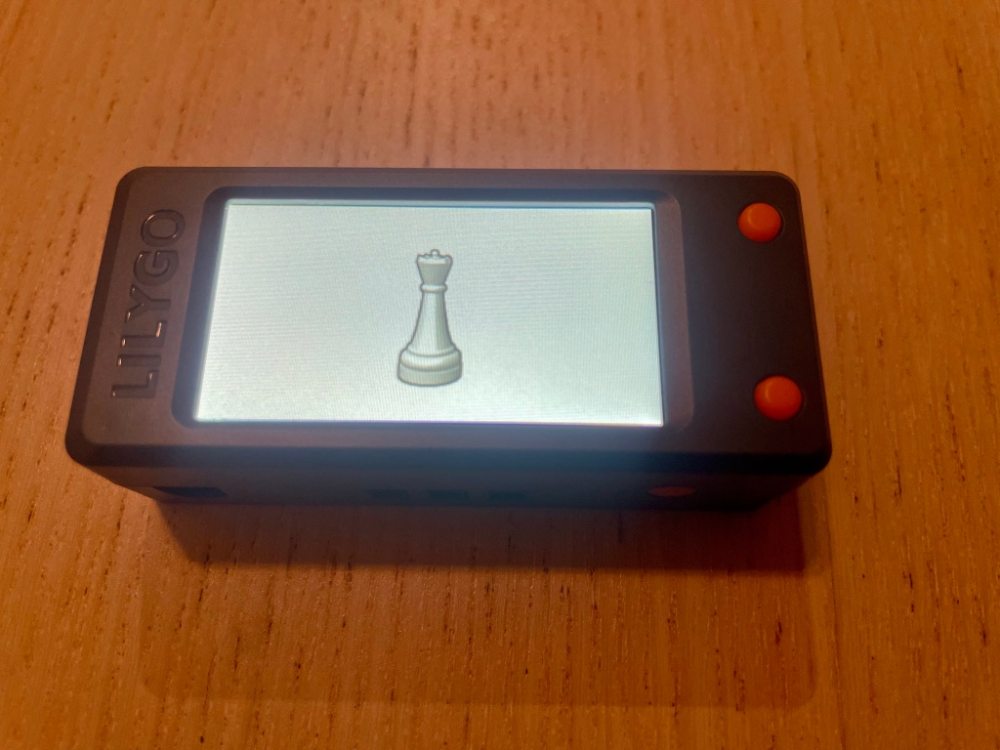

# CircuitPython program to play Dice Chess on an ESP32 board

## Description

This project implements a chess piece randomizer using a LILYGO T-Display-S3 board. It's designed to replace a traditional die in a dice chess game, randomly displaying chess pieces on the integrated screen each time that a button is pressed.

## Photos

## Features

- Displays random chess pieces on the built-in 1.9" ST7789V LCD display (170x320 pixels)
- Uses a button input to trigger new random piece selection
- Smooth animation effect when changing pieces
- Configurable for different chess pieces

## Hardware Requirements

- LILYGO T-Display-S3 board (includes an ESP32-S3 with integrated display)
- Push button connected to GPIO0

## Software Dependencies

- CircuitPython
- Adafruit CircuitPython libraries:
  - adafruit_imageload
  - adafruit_st7789

## Installation

1. Install CircuitPython on your LILYGO T-Display-S3 board.
2. Copy the following files to your board:
   - `code.py` (main script)
   - `data/` directory containing chess piece images:
     - pawn.jpg
     - rook.jpg
     - knight.jpg
     - bishop.jpg
     - queen.jpg
     - king.jpg

## Usage

1. Power on the LILYGO T-Display-S3 board.
2. The display will show a random chess piece on startup.
3. Press the button connected to GPIO0 (BUTTON0) to display a new random chess piece.
4. Press the button connected to GPIO14 (BUTTON1) to turn the display on and off.

## Customization

- Replace `board.BUTTON0` and `board.BUTTON1` to match buttons used to choose a piece and turn the display on and off.
- Modify the `chess_pieces` dictionary in `code.py` to change the available pieces or their corresponding image files.
- Adjust the `WIDTH` and `HEIGHT` constants if necessary to match the display dimensions.

## Troubleshooting

- Ensure all image files are present in the `data/` directory.
- Check that all required libraries are installed and up to date.
- Verify the button connection to GPIO0.

## Contributing

Contributions to improve the project are welcome. Please feel free to submit issues or pull requests on the project's repository.

## Image Attributions

The chess piece images used in this project are derived from Wikimedia Commons. These images have been modified to fit the resolution of the ST7789V display used in this project. Detailed attribution information for each image, including original creators, sources, and licenses, can be found in the [ATTRIBUTIONS.md](./ATTRIBUTIONS.md) file in this repository.

Please note that the images are licensed under Creative Commons Attribution-Share Alike licenses (CC BY-SA 3.0 and CC BY-SA 4.0). As per the terms of these licenses, any distribution of this project must be under the same or compatible license terms. For more details on how this affects the overall project licensing, please refer to the [LICENSE](./LICENSE) file.

## License

This project is licensed under the MIT License. The full license text can be found in the [LICENSE](./LICENSE) file.
